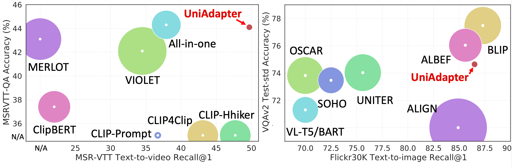

# UniAdapter

The official implementation of paper "UniAdapter: Unified Parameter-Efficient Transfer Learning for Cross-modal Modeling", by Haoyu Lu, Mingyu Ding, Yuqi Huo, Guoxing Yang, Zhiwu Lu, Wei Zhan, Masayoshi Tomizuka.

<!--
## Benckmark
### Image-text Retrieval:
Tasks | MSCOCO | Flickr30K 
--- | :---: | :---: 
14M | <a href="https://storage.googleapis.com/">Download</a>| - 
### Visual Question Answerring:
Tasks | VQA v2.0
--- | :---: 
14M | <a href="https://storage.googleapis.com/">Download</a>
### Video-text Retrieval && VideoQA:
Still working.
-->

## Getting Started

- Python3, PyTorch>=1.8.0, torchvision>=0.7.0 are required for the current codebase.
- To install the other dependencies, run
<pre/>pip install -r requirements.txt</pre> 

#### Image-text Retrieval
- Download COCO and Flickr30k datasets from the original websites, and set 'image_root' in configs/retrieval_{dataset}.yaml accordingly.

- To parameter-efficient finetune on MSCOCO/Flickr:
<pre>python -m torch.distributed.run --nproc_per_node=8 train_retrieval.py --config ./configs/retrieval_{coco, flickr}.yaml --output_dir output/{coco, flickr} </pre> 
- To evaluate UniAdapter on MSCOCO/Flickr:
<pre>python -m torch.distributed.run --nproc_per_node=8 train_retrieval.py --config ./configs/retrieval_{coco, flickr}.yaml --output_dir output/{coco, flickr} --evaluate </pre> 

#### Visual Question Answerring
- Download VQA v2 dataset and Visual Genome dataset from the original websites, and set 'vqa_root' and 'vg_root' in configs/vqa.yaml.

- To parameter-efficient finetune on VQAv2:
<pre>python -m torch.distributed.run --nproc_per_node=8 train_vqa.py --config ./configs/vqa.yaml --output_dir $static_dir</pre> 
- To evaluate UniAdapter on VQAv2 (need to update the result file to the official server):
<pre>python -m torch.distributed.run --nproc_per_node=8 train_vqa.py --config ./configs/vqa.yaml --output_dir $static_dir --evaluate </pre> 

#### Video-text Retrieval and VideoQA
- In progress.

## Acknowledgement
Our codebase is built based on BLIP, timm. We thank the authors for the nicely organized code!
